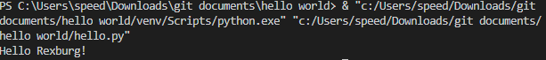

# Summary
this program prints out hello world

# development enviroment
* visual studio code
* Python 3.8.5

# execution
to use the program: `python hello.py`

# useful websites

* [Bro Macbeth help guide](https://video.byui.edu/media/0_v2afnpby)

